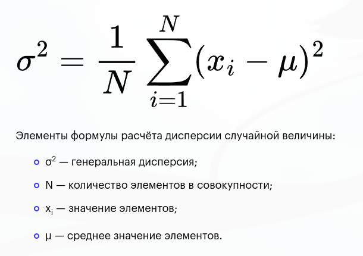
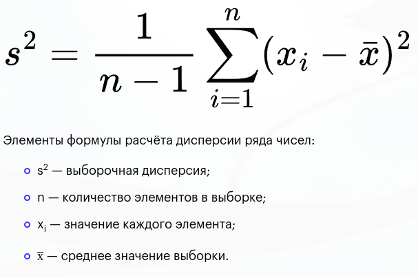
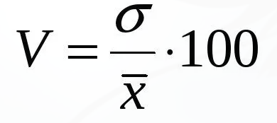

### Лабораторная 2
Наглядное представление выборочных данных. Оценка параметров распределения

#### Задание

В файле varK.csv находит выборка из нормального распределения N(a, σ) (K - номер вашего варианта). Необходимо создать Rscript, который позволит найти основные численные характеристики выборки, построить гистограмму и фукнцию рапределения, найти точечные и интервальные оценки параметров распределения.

---

## Теория

### Совокупности

**Генеральная совокупность** -- совокупность случайно отобранных объектов данного вида, над которыми проводят наблюдения с целью получения конкретных значений случайной величины, проводимых в неизменных условиях при изучении одной случайной величины данного вида.

**Выборка** - это часть генеральной совокупности элементов, которая охватывается экспериментом (наблюдением, опросом). 
Часть совокупности экономических объектов или показателей, отобранных для изучения, чтобы сделать заключение о всей совокупности. Выборка должна быть отобрана таким образом, в таком количестве, чтобы быть статистически представительной, то есть отображать исследуемую совокупность. Например, чтобы изучить спрос, предложение, цены на рынке, достаточно обследовать только его часть, отдельные сегменты рынка. 

### Основные характеристики

**Выборочное среднее** — это среднее значение выборки чисел, взятой из большей совокупности чисел. 1

Другими словами, это среднее арифметическое всех значений выборки.


Пример на R
```R
sample_mean <- mean(sample)
```

#### Дисперисия

**Генеральная дисперсия** - среднее арифметическое квадратов отклонений значений генеральной совокупности от их среднего значения.

Это показатель разброса данных вокруг их среднего значения. Высокая дисперсия указывает на большой разброс данных, а низкая — на их близость.



**Выборочная дисперсия** – это среднее арифметическое значений вариантов выборки.

- **Смещенная** Считается по той же формуле, что и обычная дисперсия.
- **Несмещенная**

Разница от генеральной и смещенной лишь в том, что в формуле выборочной дисперсии используется корректировка на размер выборки n − 1
Причина возникновения такого изменения знаменателя - в том, что при вычислении дисперсии используется ещё и оценка среднего, полученная из ЭТОЙ ЖЕ выборки.. Вывод длинный и скучный. 
Но. Если среднее значение откуда-либо точно известно заранее, то снова восстанавливается простое эн в знаменателе.

**Стандартное отклонение** - Показывает отклонение значений от среднего арифметического. Высчитывается как квадратный корень по дисперсии. 

**Коэффициент вариации** - мера разброса данных в процентах. Высокий коэффициент указывает на большую дисперсию, а низкий — на меньшую. 



### Квантили 

Значение, которое заданная случайная величина не превышает с фиксированной вероятностью

[источник примера](https://otvet.mail.ru/question/177364199)
Например скажем что случайная величина не будет больше (попадёт в интервал) x+2 с вероятностью 90% 
или не будет больше x+3 c вероятностью 99%
где x - середина интервала

**Виды**
1. **Медиана** — это 50-й процентиль (разделяет данные пополам).
2. **Квартиль** — делит данные на 4 части:
   - \( Q_1 \) (первый квартиль) — 25% данных ниже этой точки.
   - \( Q_2 \) (второй квартиль) — то же, что и медиана.
   - \( Q_3 \) (третий квартиль) — 75% данных ниже этой точки.
3. **Перцентиль** — делит данные на 100 частей.
4. **Дециль** — делит данные на 10 частей.

**Выборочные квантили** рассчитываются на основе данных из выборки, а не генеральной совокупности. Используются для оценки квантилей генеральной совокупности.

**Для рассчета выборочного квантиля**
1. **Отсортируйте данные.**
   Данные должны быть упорядочены в порядке возрастания.
   
2. **Определите \( p \) (долю).**
   Для квантиля \( p \), \( p \) находится в интервале от 0 до 1:
   - Для медианы \( p = 0.5 \).
   - Для первого квартиля \( p = 0.25 \).
   - Для третьего квартиля \( p = 0.75 \).

3. **Найдите позицию квантиля.**
   Позиция \( i \) вычисляется как:
   \[
   i = (n - 1) \cdot p + 1,
   \]
   где \( n \) — количество элементов в выборке.

4. **Определите квантиль.**
   - Если \( i \) — целое число, то квантиль равен значению на позиции \( i \) в отсортированных данных.
   - Если \( i \) — дробное число, используйте линейную интерполяцию:
     \[
     Q_p = x_{\lfloor i \rfloor} + (i - \lfloor i \rfloor) \cdot (x_{\lfloor i \rfloor + 1} - x_{\lfloor i \rfloor}),
     \]
     где \( x_{\lfloor i \rfloor} \) — значение на позиции \( \lfloor i \rfloor \), а \( x_{\lfloor i \rfloor + 1} \) — на следующей позиции.

**Пример расчета**
Дано: выборка [3, 7, 8, 5, 12, 14, 21, 13, 18].  
Рассчитаем медиану (\( p = 0.5 \)).

1. **Сортируем данные:**
   [3, 5, 7, 8, 12, 13, 14, 18, 21].

2. **Находим позицию медианы:**
   \[
   i = (n - 1) \cdot p + 1 = (9 - 1) \cdot 0.5 + 1 = 5.
   \]
   Медиана — 5-й элемент, то есть **12**.

**Квартиль \( Q_1 \) (\( p = 0.25 \)):**
1. Позиция:
   \[
   i = (9 - 1) \cdot 0.25 + 1 = 3.
   \]
   Квартиль \( Q_1 \) — 3-й элемент, то есть **7**.

**Квартиль \( Q_3 \) (\( p = 0.75 \)):**
1. Позиция:
   \[
   i = (9 - 1) \cdot 0.75 + 1 = 7.
   \]
   Квартиль \( Q_3 \) — 7-й элемент, то есть **14**.

Пример на R
```R
sample_quantiles <- quantile(sample)
```

