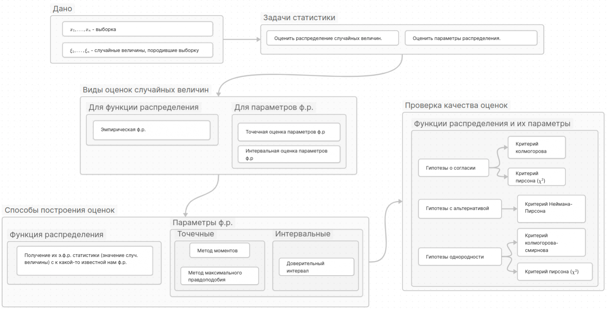
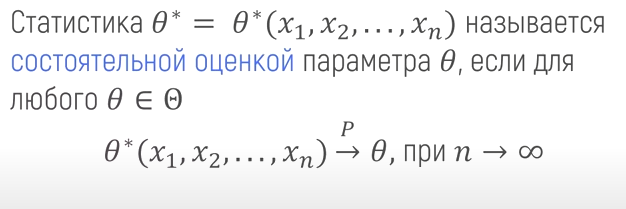
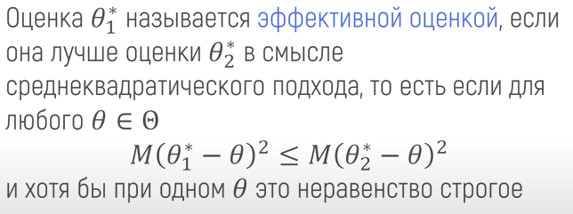

## Матстат в одной схеме

[источник](https://habr.com/ru/articles/847120/)

Главная задача матстатистики - оценка распределения случайных величин, основываясь на выборке. Рассматривается выборка x1, x2, x3.. xn, которая является реализацией случайных величин. Предполагается, что случайные величины одинакого распределены и в совокупности независимы

## Статистики и параметры

Статистикой называют произвольную измеримую функцию, зависещую от выборки и не зависещей от тета

Статистики оценивают параметры совокупности, так как при разных выборках одной и той же совокупности они будут менятся, но при увеличчении кол-ва выборки будут все ближе к значению параметров

#### Свойства оценок
- **несмещенность:** Оценка, мат. ожидание которой равно истинному значению оцениваемого параметра. Отсутствие ошибки в среднем

- **состоятельность:** Последовательность оценок приближается к оцениваемому параметру при увеличении кол-ва выборки

- **асимптотическая нормальность:** Распределение оценки стремиться к номральному при увеличении выборки. В отличии от состоятельности, где стремление оценки к параметру неизвестно.

- **эффективность:** Необходимо для сравнения нескольки оценок между собой. Если дисперсия оценки в некотором классе оценок минимальна, то она называется эффективной. 
