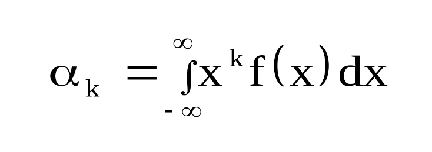
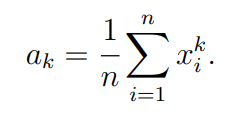
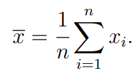
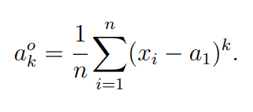
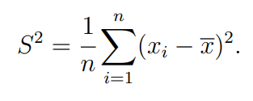

# Моменты

**Момент** - числовая характеристика распределения случайной величины 

## Начальные моменты

Начальным моментом k-го порядка случайной величины называется математическое ожидание k-й степени этой величины

Называется именно **начальным**, так как рассчитывается относительно 0, от **начала** координат

Формула начальных моментов

В дискретном случае

В непрерывном случае

## Центральные моменты

Называются **центральными**, так как счет ведется относительно **среднего** значения

Формула центральных моментов

## Выборочные характеристики

#### Выборочный момент порядка k

Из него выводится момент 1-го порядка, либо же **выборочное среднее**

По вариационному ряду

По статистическому ряду (выборочное среднее на картинке указано другой буквой, это не важно)

#### Выборочный центральный момент порядка k 

С его помощью можно легко вывести **выборочную дисперсию**

Момент 1-го порядка по статистическому ряду
