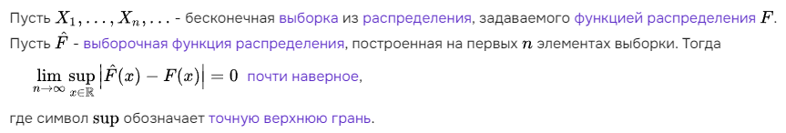

### Теорема Гливенко - Кантелли

[источник](https://ru.ruwiki.ru/wiki/Теорема_Гливенко_—_Кантелли)

> **Супремум** - верхняя граница множества

Теорема утверждает, что для почти любой выборки, которая может породится в рамках эксперимента, при увеличении количества элементов выборки, не просто разность инстенного распределения и оценки стремится к нулю, а даже супремум этой разности стремится к нулю. 

[источник 2](https://www.youtube.com/watch?v=UEsF_tLVQ-U&t=81s)

С ростом объема выборки эмпирическая функция распределения сходится по вероятности к неизвестной теоритической при любом фиксированном *y*

При чем наибольшее из расхождений между эмпирической и теоретической функцией распределения стремится к 0