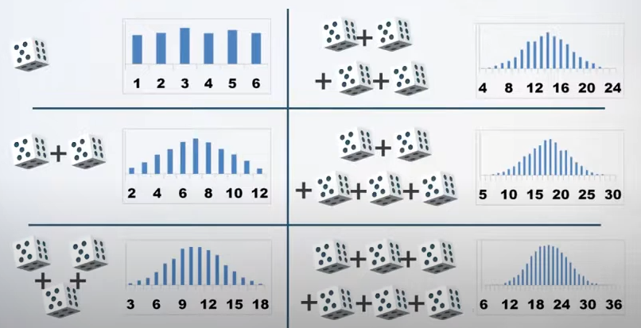

# Центральная Предельная Теорема

Говорит о том, что, **сумма случайных величин**, в случае, если они независимы и не влияют на друг друга, при этом не сильно отличаются друг от друга, в пределе **имеет распределение, близикое к нормальному**.

На картинке показаны вероятности выпадения какого-либо числа (суммы чисел) на игральной кости (костях), что хорошо иллюстрирует ЦПТ

