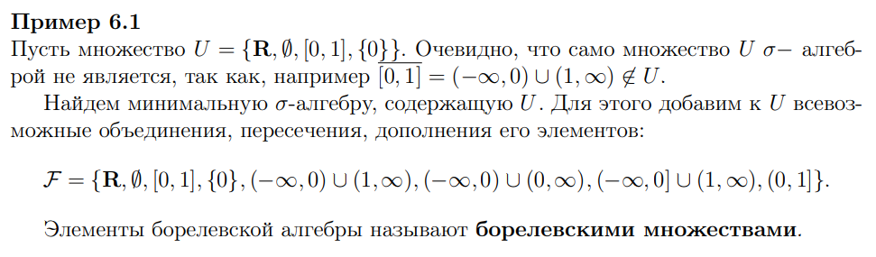

# Борелевская сигма-алгебра

Обозначается как $B$

Это минимальная сигма-алгебра, содержащая все интервалы на прямой, полученных всевозможными дополнениями, объединениями, пересечениями множеств изначальной алгебры

### Что такое минимальная сигма-алгебра

Наименьшая сигма-алгебра, которую возможно получить, которая удовлетворяет условиям:
- Содержит все элементы изначального множества
- Включает в себя все, что можно получить из изначального множества путем объединения, перечесения и дополнения

