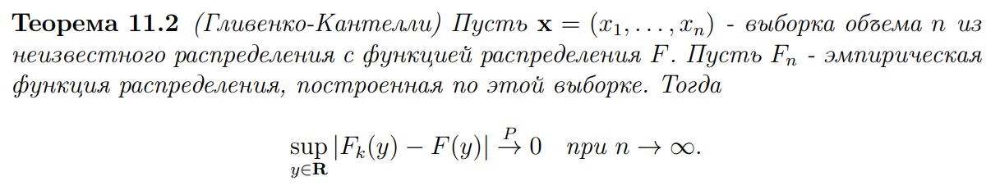
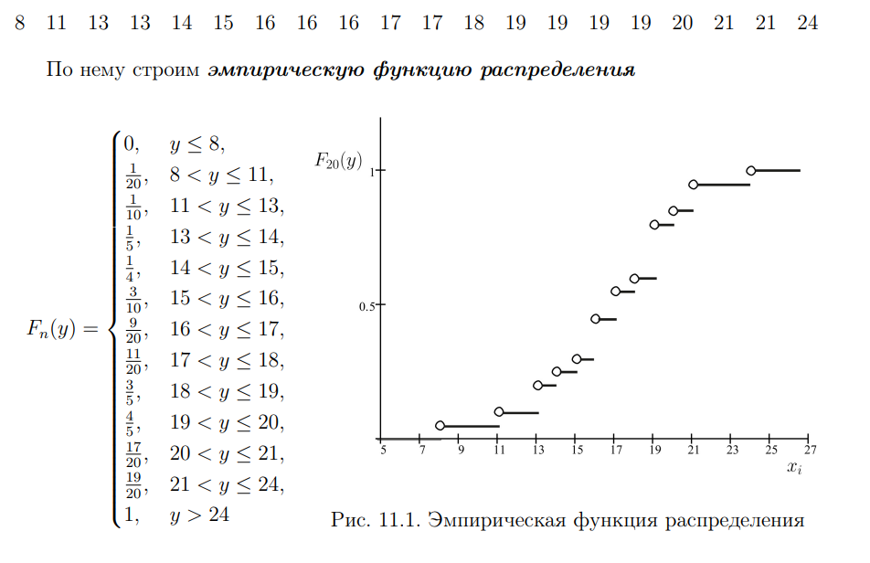

## Выборка

Это множество отдельных наблюдаемых испытаний из генеральной совокупности

Для того, чтоб по выборке можно было судить что-то о совокупности, она должна быть:
- Случайной. При сборе элементов должна соблюдаться случайность выбора (св-о репрезентативности)
- Все эксперименты должны быть независимы

**Формы представления**

- Табличный
- **Частотный**. Делится на группы по несколько интервалов и указывается количество элементов, попавших в этот интервал
- **Вариационный ряд**. Все элементы упорялочены по возрастанию
- **Эмпирическая функция**
- Наглядные варианты
  - **Гистограмма**
  - **Полигон частот**

### Эмпирическая функция и ее свойства

Является случайной величиной. При возврастании объема выборки стремится к функции распределения исходного распределения генеральной совокупности

**Совойства**

- Неубывающая
- Соотвествует правилу нормировки
- Сходится к истинной функции распределения

**Пример**

## Медиана и мода

**Медианой** выборки называют такое значение ряда, которое разделяет его на пополам.

Особенности:
- Если кол-во значений в ряду нечетное, то медиана - один элемент посередине ряда
- Если кол-во четное и два сосседних средних значения отличаются, то берется любое из них, но чаще всего ср. арифметическое по ним

**Модой** называется элемент, который встречается в ряду чаще всего. 

Особенности:
- Если два самых частых соседних элемента имеют одинаковую частоту, то считается, что мода - ср. арифметическое из них
- Если все элементы имеют одну частоту, то считается, что моды нет
- Если два несоседних самых частых элемента имеют одну частоту, то ряд называется бимодальным. Более двух - полимодальным

