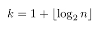

## Гистограмма

Гистограмма показывает, как распределены данные выборки по интервалам. Высота столбца гистограммы пропорциональна частоте попадания элементов выборки в интервал

**Шаги построения**

1. **Разделение на интервалы.** Нужно определить кол-во интервалов.
    - к примеру может подойти правило Стерджесса 
    

2. **Находим высоту каждого интервала.** Делается это по формуле
    - Где n~j~ - количество элементов в интервале, l~j~ - длина интервала, n - обшщее число выборки
    

**Важно**
Сумма площадей всех прямоугольников должна быть равна 1

**Теорема сходимости гистограммы**

#### Полигон частот

Если середины верхних горизонтальных отрезков соединить прямыми, то получится полигон частот

