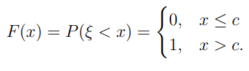
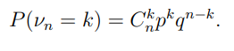
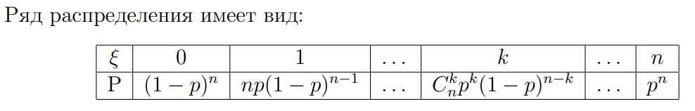
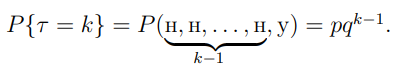
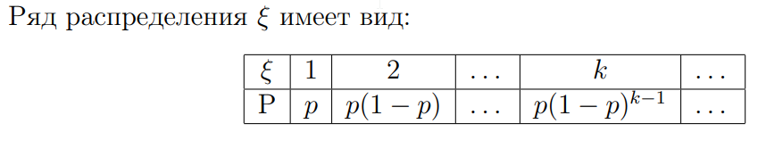

# Примеры дискретных распределений 

#### Вырожденное распределение

$ξ$ принимает единственное значение с вероятностью 1

#### Бернулли

$ξ$ принимает два значеня: 
- успех
- неудача

У случаев может быть разная вероятность

|$ξ$|0|1|
|-|-|-|
|$P$|$1-p$|$p$|

#### Биноминальное

Принимает парметры $k = 0, 1, .., n$ где $n ∈ N$ и $p ∈ (0,1)$ с вероятностями в виде формулы Бернулли:

Только вместо v~n~ должна быть $ξ$

Распределение показывает число успехов в фиксированном числе испытаний. При условии, что при каждом испытании вероятность успеха не менятся.

**Пример**

Подбрасывание монеты n раз, где успех — выпадение орла. Если вероятность орла равнв 0.5, то распределение описывает, сколько раз выпадет орёл за n подбрасываний.

#### Геометрическое

Описывает количество испытаний до первого успеха

#### Пуассона

Описывает кол-во событий, которые происходят за определенный интервал времени, пространства, другой области, при условии:
- События происходят независимо друг от друга
- С постоянной средней интенсивностью

**Пример**

**Задача**: Среднее число звонков в колл-центр за час — 5 (\( \lambda = 5 \)). Найти вероятность того, что за час поступит ровно 3 звонка (\( X = 3 \)).

**Решение**:
\[
P(X = 3) = \frac{\lambda^k e^{-\lambda}}{k!} = \frac{5^3 e^{-5}}{3!}.
\]
1. \( 5^3 = 125 \), \( 3! = 6 \), \( e^{-5} \approx 0.0067 \).
2. Подставляем:
\[
P(X = 3) = \frac{125 \cdot 0.0067}{6} \approx \frac{0.8375}{6} \approx 0.1396.
\]
Вероятность того, что за час поступит ровно 3 звонка, составляет \( 13.96\% \).
