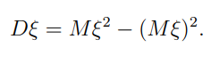
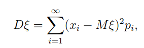
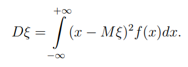
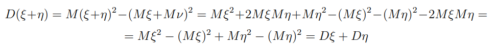

## Дисперсия

Ее корень называется среднеквадратическим отклонением или стандартным отклонением

Для дискретных величин

Для непрерывных величин

### Свойства

1. Дисперсия константы равна 0

2. $D(Cξ) = C^2 D(ξ)$

3. Дисперсия суммы равняется сумме дисперсий 

