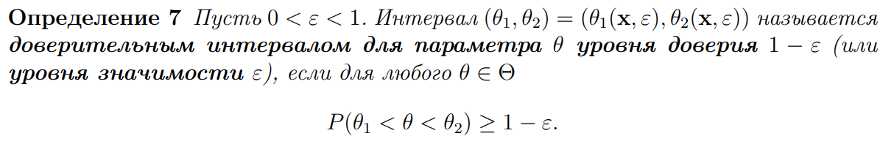
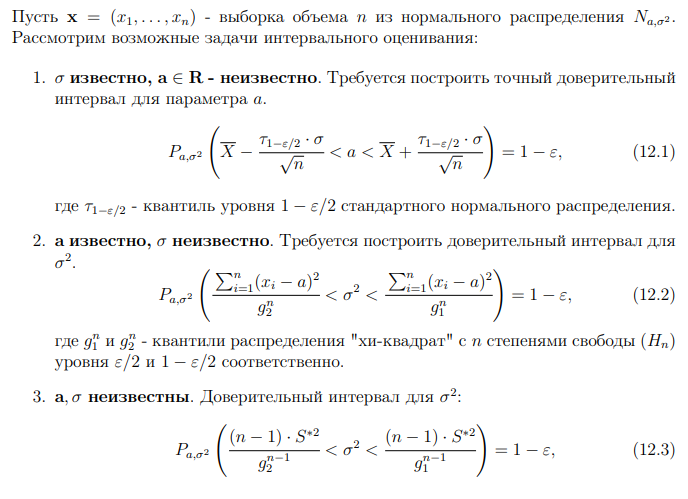
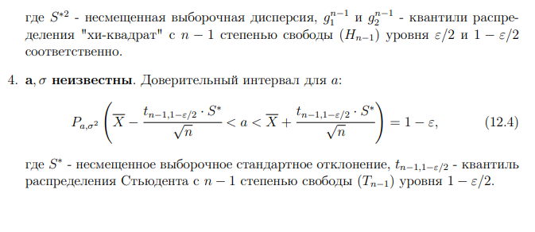

## Доверительный интервал 

При оценке параметров мы не всегда можем предположить, насколько близко наше значение соответствует действительности. Для решения этой проблемы было придумано **интервальное оценивание**. Мы указываем интервал, внутри которого с высокой вероятностью $1 − ε$ находится точное занчение парметра. 

## Доверительные интервалы для нормального распределения

