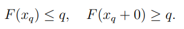
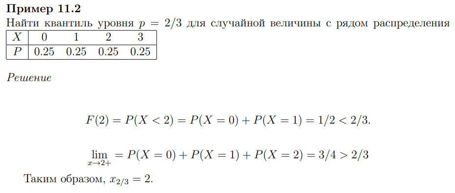

### Квантиль 
Квантилем порядка $q$ называется такое значение случайной величины, что

Часто в качестве квантиля берут максимальное значение, при котором выполняется формула $F(x)≤q$

### Медиана

Медианой называется квантиль уровня 1/2

### Мода

В непрерывном случае
- Любая точка локального максимума функции плотности, если она абсолютно неприрывна

В дискретном случае
- Любое значение x, для которого максимальна вероятность $P(ξ=x)$