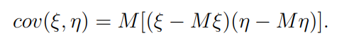
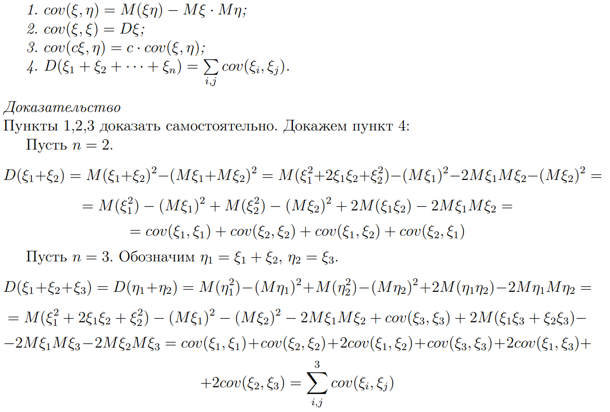
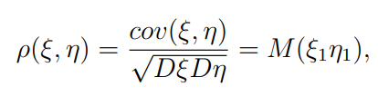
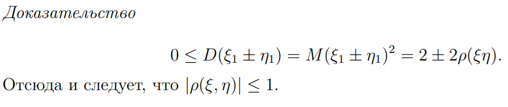
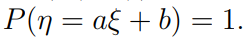
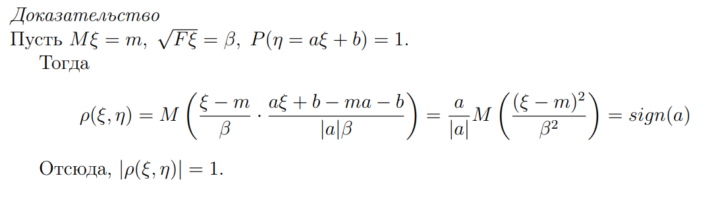
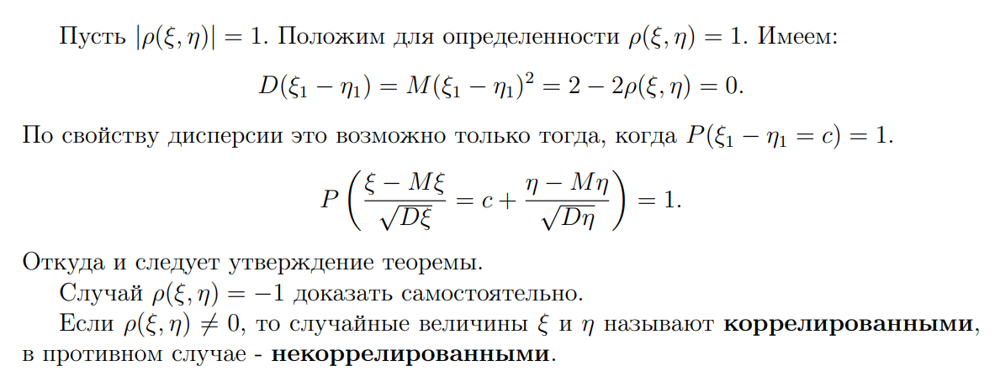

Для определения степени зависимости случайных величин друг от друга используют ковариацию и корреляцию

## Ковариация

Показывает направление и силу взаимосвязи

Определяется как мат. ожидание отклонений от средних ззначений двух случайных величин

## Корреляция 

Это нормированная ковариация, она позволяет легче оперировать с определением зависимости двух случаных величин

Где случайные величины в мат ожидании - нормированные 

**Свойства**

- Модуль коэфициента корреляции $≤ 1$

- Если случайные величины независимы, то коэф. корр. равен 0. Это следует из того, что нормированные случайные величины нормированы
- Коэф. корреляции = 1 или -1 тогда, когда существуют такие не нулевые числа $a$ и $b$, что 

