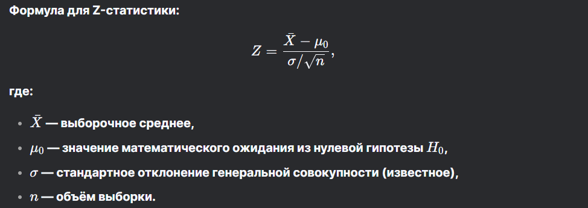

# Критерии проверки гипотез 

### Статический критерий

Это такое правило, которое принимает одну из двух противоположных гипотез

**Характеристики**
- Ошибки первого-второго рода
  - Ошибка первого рода: мы отвергли H~0~, хотя она верна (забраковали годное изделие). Вероятность такого обозначается как $a$~1~
  - Ошибка второга рода: мы приняли H~0~, хотя верна H~1~ (пропустили брак). Вероятность такого обозначается как $a$~2~

- Уровень значимости и мощности
  - Уровень значимости - вероятность ошибки первого рода
  - Мощность критерия - вероятность правильно отклонить H~0~, когда верна H~1~

#### Критерий согласия
Ялвяется также статическим критерием.
Проверяет, соответствует ли распределение выборки теоретическому распределению
  - Основаня гипотеза говорит, что соответствует
  - Алтернативная, что нет

--- 
#### Z статистика (нет в лекциях)

Позволяет определить на основе выборки насколько данные согласуются с нулевой гипотезой

- Значение в критической области - гипотеза не отвергается
- Значение вне области - отвергается 

Критическая область определяется уровнем значимости $α$ и она табулирована

---

В лекциях многоуважаемой Кустицкой отсутствуют виды критериев

Возможно, она не будет их спрашивать, но кто знает, может она меняет не только условия автоматов в конце семетра, но и всю программу перед экзаменом? (12/01/2025)

1. **Параметрические критерии:**
   - Предполагают определённый тип распределения данных.
   - Например:
     - **t-критерий Стьюдента:** для проверки равенства средних двух нормальных распределений.
     - **F-критерий Фишера:** для проверки равенства дисперсий.
     - **Z-критерий:** для проверки гипотез о средних при известной дисперсии.

2. **Непараметрические критерии:**
   - Не требуют предположений о типе распределения данных.
   - Например:
     - **Критерий Манна-Уитни:** для проверки равенства медиан двух выборок.
     - **Критерий Колмогорова-Смирнова:** для проверки соответствия данных заданному распределению.
     - **Критерий хи-квадрат (\(\chi^2\)):** для проверки гипотез о частотах.

3. **Байесовские критерии:**
   - Основываются на апостериорных вероятностях гипотез.
   - Используются для оценки, какая гипотеза более правдоподобна, с учётом данных.

