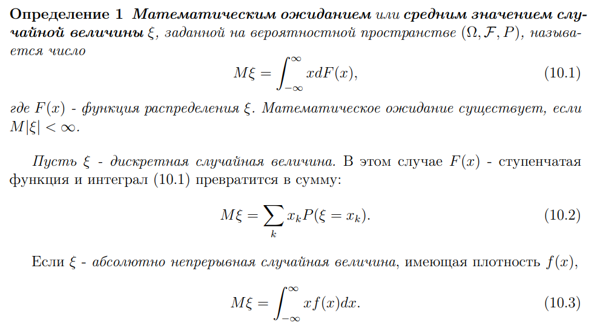
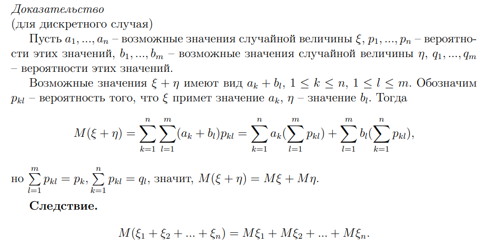
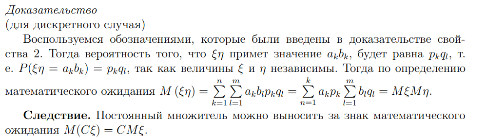
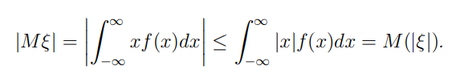
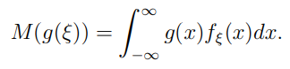
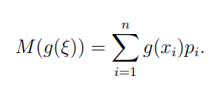
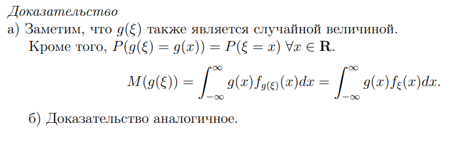

# Математитческое ожидание 

Это среднее значение случайной величины, к которому оно стремится при увеличении количества испытаний. Своеобразный центр тяжести

## Свойства

1. Математическое ожидание постоянной равно постоянной. Доказывается тем, что константу можно принимать как дискретную случ. величину, которая принимает 1 значение 
2. Мат. ожидание суммы случ. величин равно сумме мат. ожиданий этих величин.

3. Мат. ожидание произведения равно произведению мат. ожиданий

4. Модуль мат. ожидания ≤ мат. ожидания модуля. Выводится это из свойств модуля интегралов

5. Для неслучайной функции $g(x)$

и в дискретном случае

Доказательство по сути в том, что функция от случайной величины также является случайной величиной

