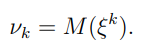
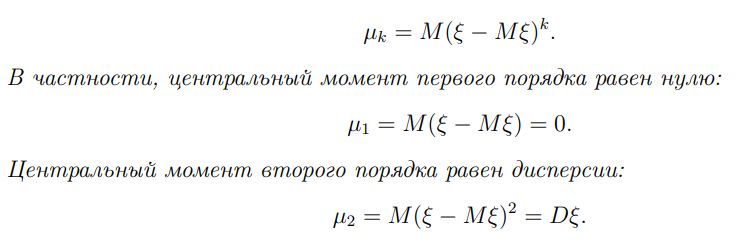

## Моменты распределения

В нашем курсе их изучается всего два

#### Начальный момент $k$-го порядка

Равен мат. ожиданию случ. величины в степени $k$

В частности, начальный момент 1-го порядка равен привычному мат ожиданию

#### Центральный момент порядка $k$

Центральным моментом называют мат. ожидание разности случ. величины и мат. ожидания этой величины, которое возведено в степень $k$

