# Непрерывные распределения

#### Равномерное распределение 

Функция плотности
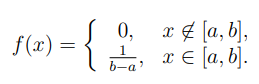

Функция распределения
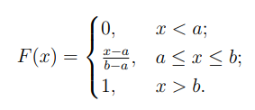

#### Показательное распределение

Случайная величина имеет показательное (экспоненциальное распределение), с параметром $λ>0$

Функция плотности
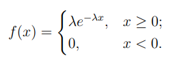

Функция распределения
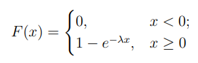

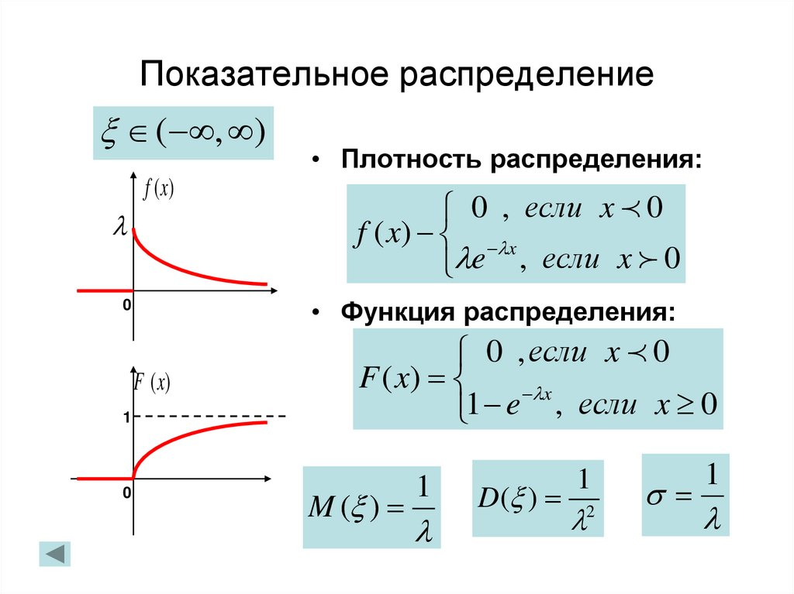

#### Нормальное распределение (Гаусса)

Одно из самых частых распределений, которые встречаются

Функция плотности
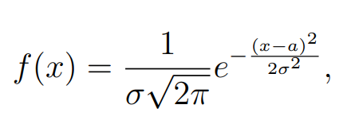

Функция распределения
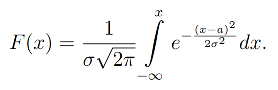

$a$ и $σ$ - некоторые постоянные, которые присваиваются распредению и являются ее параметрами. Если установить на их значения 0 и 1 соответственно, то получим **стандартное нормальное распределение**

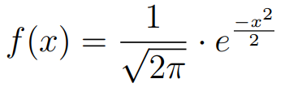

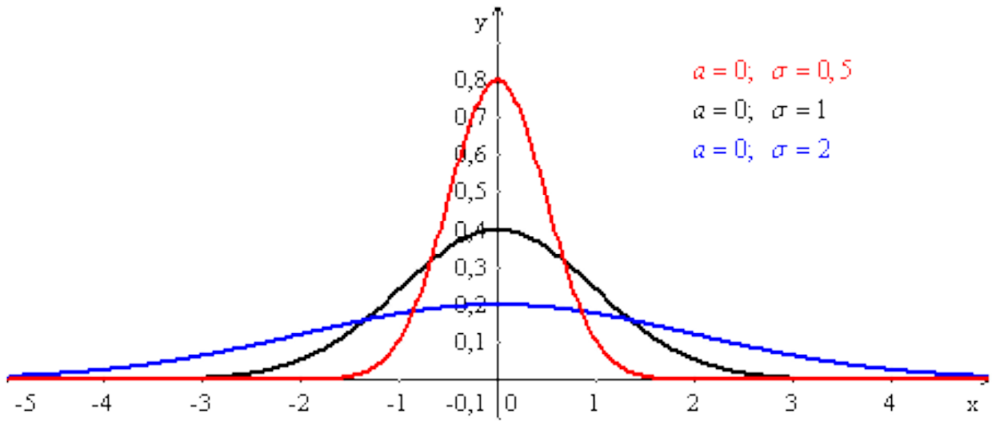

Функция Лапласа помогает определить вероятность попадания случайной величины в данный отрезок нормального распределения

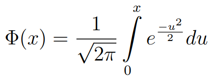

С ее спомощью выводится правило **трех сигм**, которое показывает, что вероятность отклонения случайной величины данного значения $a$, меньше, чем 0.0027

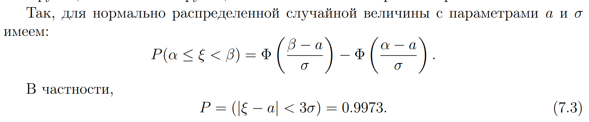