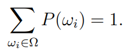
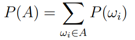
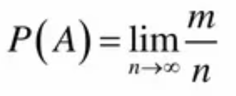
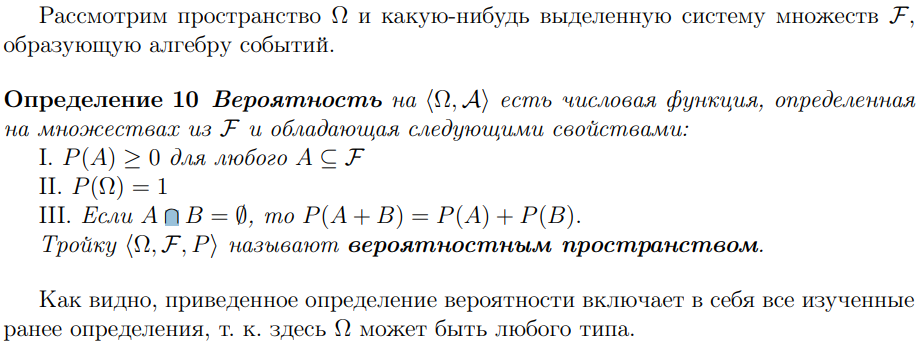

# Определения вероятностей

## Классическое 

***Понятным языком***

Отношение благоприятных исходов события к общим (т.е. к общему количеству всех исходов).

*Формула:* P(A)= m/n
  - m - количество благоприятных исходов
  - n - количество всех **равновозможных** исходов

***На*** ~~ящерском~~ ***математическом***

Имеется пространство элементарных исходов
$Ω=\{w1, w2, w3, ..., wn\}$

Каждому элементу поставим в соответсвие число $P(wi)∈[0,1]$, которое назовем вероятностью исхода $wi$

Сумма всех этих чисел должна быть равна 1

Вероятностью события **A** $⊆Ω$ назовем сумму вероятностей всех исходов, которые содержит в себе это самое событие **A**

В случае же если событие не содержит в себе исходов (является пустым), то мы сичтаем его вероятность равной 0
>В случае $A = ∅$ полагаем $p(A) = 0.$

## Статистическое

***Понятным языком***

Отношение серии испытаний, в которых данное случайное событие наступило, к общему числу испытаний (достаточно большому) называется **относительной частотой события**

*Относительная частота* = m / n
- m - число испытаний, где событие произошло
- n - общее количество испытаний 

Предел этой частоты, где n стермится к бесконечности, называется статистическим определением вероятности

***На*** ~~ящерском~~ ***математическом***

В лекции указаны только причины, по которым оно существует, а именно

1. Классическое определение применимо только при симметрии исходов
2. Классическое определение не работает в случае, когда $Ω$ не является конечным 

## Аксиоматическое

***Понятным языком***

Вероятностью называется функция $P(A)$, которая принимает действительные значения и удовлетворяет трем аксиомам

1. Неотрецательности - $P(a)≥0$
2. Нормировки - $P(Ω) = 1$
3. Аддитивности - Если $A∩B=0$, то $P(A+B)=P(A)+P(B)$

***На*** ~~ящерском~~ ***математическом***

