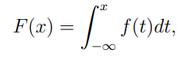
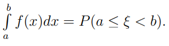
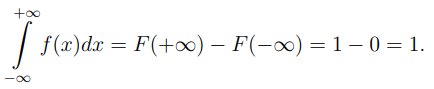

## Плотность распределения

Это производная функции распределения непрерывной случайной величины 

Существует, если $F(x)$ может быть представлена в виде

**Свойства**

1. $f(x)=F`(x)$ почти для всех x, кроме, возможно, тех, которые принадлежать множеству нулевой меры Лебега

2. Плотность рапсределеня - неотрицательная функция, таукк как явлвяется производной от неубывающей функции

3. По формуле Ньютона-Лейбница интеграл преобразуется в вид справа от уравнения 

4. Свойство нормировки 
