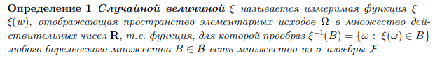

# Случайная величина 𝜉

**Простое объяснение**

Это величина, значение которой зависит от исхода какого-либо эксперимента.

**Из лекций**

Случайная величина $𝜉$ - это функция, которая преобразует случай ($ω$) из множества элементарных исходов ($Ω$) в число 

*Обозначения*

- $Ω$ - множество всех исходов. К примеру: орел и решка
- $F$ - сигма-алгебра подмножеств $Ω$. Множество событий, для которых можно задать вероятность

Для того, чтоб функция считалась случайной величиной, она должна быть **измеримой**

**Измеримость** - Для любого множества B из борелевской сигмы-алгебры прообраз этого множества через случайную величину долен быть событием из F

Измеримость позволяет гарантировать, что случайная величина сохраняет связь между событиями и вероятностями

## Типы случайных величин 

- Дискретные - если может принимать конечное или счетное множество значений
- Непрерывные - если может принимать любое значение из промежутка
- Смешанные - если одновременно содержит дискретную и непрерывную части

### **Примеры распределений по типам случайных величин**

| Тип                | Пример распределения    | Описание                                           |
|--------------------|-------------------------|---------------------------------------------------|
| Дискретная         | Бернуллиевское, биномиальное, геометрическое | Конечное или счётное множество значений.         |
| Непрерывная        | Нормальное, равномерное, экспоненциальное   | Значения на вещественной прямой.                 |
| Смешанная          | Распределение с "выбросом" в точке          | Содержит и дискретные, и непрерывные компоненты. |
