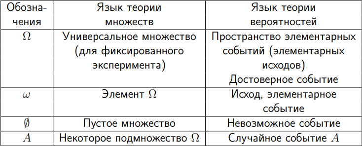
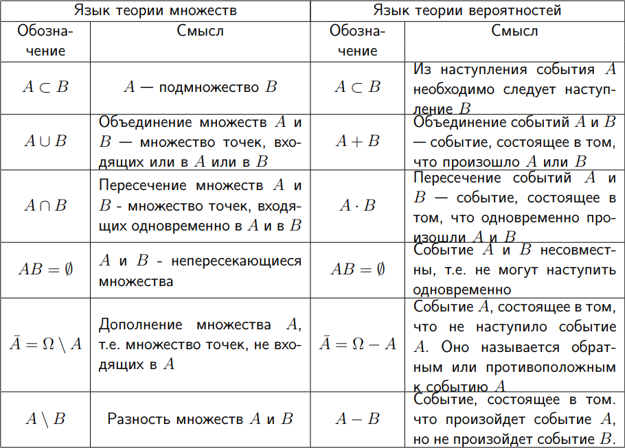

## Стахостический эксперимент
Это эксперимент, при котором известны все все возможные исходы, их вероятности, но нельзя определить, какой из них наступит в ходе эксперимента 

## Операции над случайными величинами 

**Обозначения**

**Операции**

