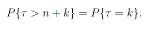
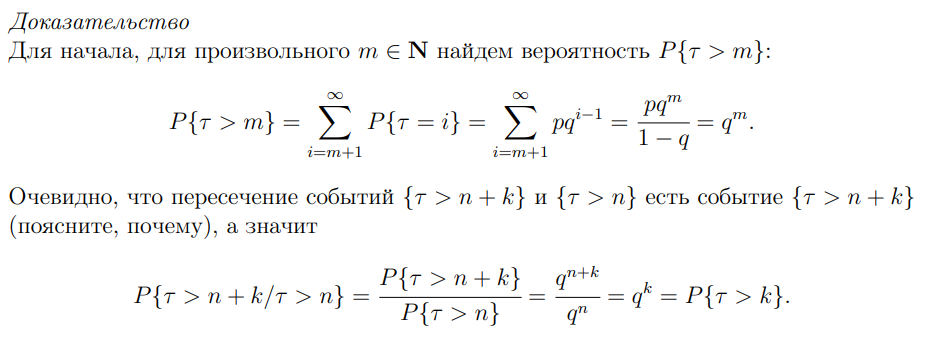
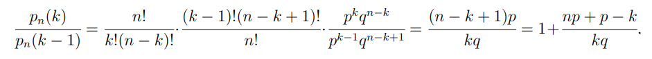

### Схема Бернулли

Это последователность испытаний, при которых есть два исхода
- ***p*** - Успех. Происходит с вероятностью $[0, 1]$
- ***q*** - Неудача. Происходит с вероятностью $q = 1 - p$

### Формула Бернулли

Позволяет определить вероятность появления события A определенное количество раз за некое количество независимых испытаний

**Доказательство**

Вероятность того, что  за $n$ испытаний будет ровно $k$ успехов и $k-n$ неудач равно $ p^k * q^{n-k} $, лишь с тем условием, что их порядок может быть различен.
Количество способов расположить $k$ успехов на $n$ местах домножаем на полученную вероятность и получаем формулу Бернулли

### Номер первого успешного испытания

Вероятность того, что первое успешное испытание произойдет на n-ном испытании

Введем обозначение $𝜏$, которое будет означать номер первого успеха в схеме Бернулли

Найдем вероятность того, что $𝜏=k$:
- Первые $k-1$ испытаний были неудачными
- На $k$-м испытании произошел успех

**Свойство нестарения** - черта геометрического распределения. Означает, что вероятность первого успеха не зависит от того, сколько неудач уже произошло

**Доказательство**

Первую часть с картинки ниже можно доказать проще. Так как m-ный элемент не является успешным, значит все элементы до него тоже неуспешны, а вероятность такого исхода является $q^m$

Во второй части мы просто используем формулу условной вероятности

### Наиболее вероятное число успехов

Для нахождения наиболее вероятного числа успехов сравним две функции:
- $p$~n~$(k)$
- $p$~n~$(k-1)$

Для каждой функции распишем ее вид по формуле Бернулли и составим соотношение

Исследуем отношение:
- больше 1 при $p$~n~$(k) > p$~n~$(k-1)$
- меньше 1 при $p$~n~$(k) < p$~n~$(k-1)$
- равно 1 $p$~n~$(k) = p$~n~$(k-1)$

Далее находим точку равновесия, приравняв эти две функции к 1
Получим $k=np+p$

**Теорема о наиболее вероятном числе успехов**

1. Если $k=np+p$ - не целое число, то наиболее вероятное значение является целой частью полученного значения
2. Если $k=np+p$ - целое число, то наиболее вероятными значениями являются два соседних значения $k=np+p$ и $k=np+p - 1$