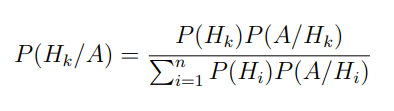
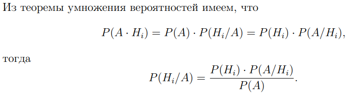
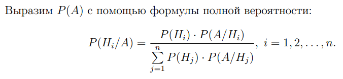

## Формула Байеса 

**Общепринятая**

A и B - два события, вероятность B больше 0

Вероятность события A, при условии, что произошло B, высчитывается по формуле 

$P(A|B)= P(B|A)*P(A) / P(B)$

**Лекция Кустицкой** / **С попарно несовместными событиями**

$H1, H2, H3, ... Hn$ - попарно несовместные события, верояность каждого > 0, свойство нормировки соблюдается 

Условная вероятность того, что при наступлении некого $Hk$ наблюдалось событие A может быть вычислено по формуле 

**Доказательство**

