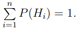
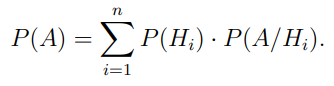
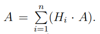
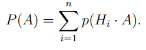
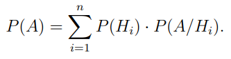

# Формула полной вероятности

В случае, если событие A может произойти только при выполнении одного из событий $H1, H2, H3, ... Hn$, которые являются попарно несовместными, при том, что
- $P(Hi)>0$
- 

То вероятность такого события высчитывается по формуле 

#### Доказательство

Из условий составим формулу

Все события $Hi*A$ являются несовместными

Так как все события несовместны, то можно получить вероятность события A, используя теорему сложения

Применим теорему умножения

