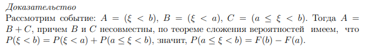

## Функция распределения

Показывает "накопленную вероятность". Вероятность того, что значение случайной величины явлется меньше $x$

$F(x)=P(ξ<x)$

**Свойства**

- Неубывающая. С ростом $x$ вероятность не уменьшается
- $F(-∞) = 0$ и $F(+∞) = 1$. Так как меньше отрицательной бесконечности нет ничего, а во втором случае по свойству нормровки сумма вероятности всех событий = 1, и все эти события меньше бесконечности.
- Вероятность попадания в интервал $[a, b)$ равна $P(a≤ξ<b)=F(b)-F(a)$

- Непрерывность слева. Вероятность в точке $x$ накоплена до этой самой точки, но не включает ее.

## Ряд распределения

Сотсоит из двух строк
- все вомзожные значения ξ
- вероятность того, что случайная величина примет это значение

**Пример**

Для игральной кости ряд рапсределения будет таким
|$ξ$|1|2|3|4|5|6|
|-  |-|-|-|-|-|-|
|$p$|1/6|1/6|1/6|1/6|1/6|1/6|

