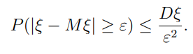
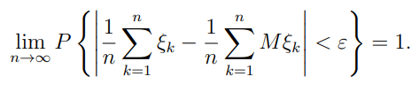
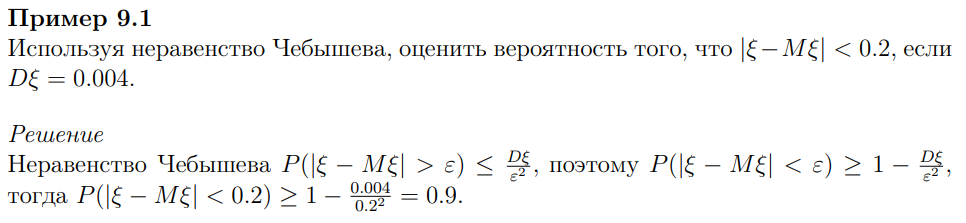
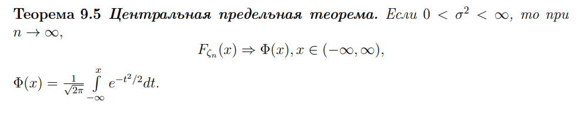

## Закон больших чисел

При достаточном большом количестве испытаний случайные величины перестают быть действительно случайными на столько, что их среднее значение становится довольно легко предсказать

**Неравенство Чебышева**

Позволяет определить насколько мала вероятность того, что случайная величина отклонится от среднего значения на величину, больше заданной $(ε)$

**Теорема Чебышева**

Суть в том, что чем больше у нас опытов $(n)$, то вероятность того, что разность мат.ожидания и самой случайной величины по модулю будет меньше любого $(ε)$>0

**Задача**

## Центральная предельная теорема

Гласит о том, что сумма большого числа независимых величин приближается к нормальному, даже если исходное распределение имело другой вид

**Интуитивное объяснение**

К примеру мы считаем число "орлов". Тогда, при большом количестве экспериментов, относительная частота приближается к нормальному, даже если изначально задается распределением Бернулли

