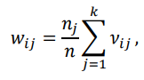

## Криетрий Хи-квадрат проверки гипотезы распределения

Алгоритм проверки гипотезы

1. Определяемся с уровнем значимости $α < 1$ (0.1, 0.05 к примеру)
2. Разбиваем данные на интервалы 
3. Рассчитываем статистику $χ^2$
 - Формула
 
    - $v$~j~ - число наблюдений в j-том интервале
    - n - общий объем выборки
    - p~j~ - теоретическая вероятность попадания в интервал
4. Находим критическое значение $c$, которе определяется из таблицы 
5. Сравнинваем статистику с критическим значением  
  - Формула 
  

---

## Проверка гипотезы независимости

1. **Определяем уровень значимости**

2. **Формируем матрицу сопряженности**. Она показывает, как часто в выборке встрается пара какая-либо элементов. 

К примеру имеется две выборки
X=[A, A, B, B, C, C, A, B, C] и Y=[1, 2, 1, 2, 1, 2, 1, 1, 2].

|X|A|A|B|B|C|C|A|B|C|
|-|-|-|-|-|-|-|-|-|-|
|Y|1|2|1|2|1|2|1|1|2|

- Пара \((A, 1)\): встречается 2 раза.  
- Пара \((A, 2)\): встречается 1 раз.  
- Пара \((B, 1)\): встречается 2 раза.  
- Пара \((B, 2)\): встречается 1 раз.  
- Пара \((C, 1)\): встречается 1 раз.  
- Пара \((C, 2)\): встречается 2 раза. 

Получаем:

| \(X\setminus Y\) | \(1\) | \(2\) |  
|-------------------|-------|-------|  
| \(A\)            | \(2\) | \(1\) |  
| \(B\)            | \(2\) | \(1\) |  
| \(C\)            | \(1\) | \(2\) |  

3. **Находим выборочное значение статистики**
    - Частоты появления пары
    
    - Формула Хи-Квадрат
    
4. **Находим критическое значение статистики**
    - Формула
    
5. **Сравниваем**
    - Формула
    

---

## Проверка гипотезы однородности

Проверяется факт того, имеют ли выборки разные распределения

- Нулевая гипотеза: Все выборки имеют одно и то же распределение
- Альтернативаная гипотеза: Выборки имеют разное распределение

**Алгоритм**

1. Определяем уровень значимости
2. Разбиваем данные выборки на интервалы 
3. Определяем частоты попадания в интервалы для каждой выборки
4. Определяем ожидаемые частоты попадания
    - формула 
    
      - **n~j~** - общее число элементов в j-ой выборке
      - **n** - общее число элементов во всех выборках
      - Сумма **v~ij~** - сумма элементов в интервале (по всем выборкам)
5. Вычисляем статистику критерия
    - формула
    
6. Сравниваем с критическим значением $χ^-1$~(s-1)(k-1)~, где s - число интервалов, k - число выборок
    - Формула
    

---

## Проверка гипотезы случайности

Говорит о том, что данные расположены в случайном проядке 

#### Идея критерия

Данные в выборке должны быть неупорядоченными. мы измеряем степень хаоса с помощью инверсий. 

**Инверсия** - когда более раннее значение в выборке больше, чем более позднее. 
Общее число инверсий обозначается как $T$~n~$(x)$. Считается суммой всех инверсий

**Нормировка** - так как при увеличении выборки количество инверсий тоже увеличивается, то их нужно нормировать

**Сравнение с критическим значением**

Так как после нормировки инверсия стремится к нормальному распределению, мы можем провести сравнение

