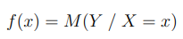
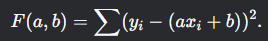
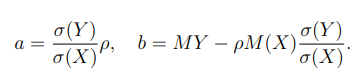
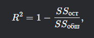
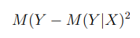
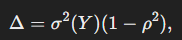

### Регрессия

Пусть между случайными величинами $X$ и $Y$ существует зависимость.
Тогда функция этой зависимости будет выглядеть как

Это **уравнение регрессии**

**Этапы регрессионного анализа**

1. Выбор формы зависимости
    - Выбираем тип уравнения зависимости между $X$ и $Y$ (линейная, экспоненциальная, степенная)

2. Вычисление коэффициентов выбранного уравнения
    - Подбираем параметры модели ($a$ и $b$ для линейной регрессии, к примеру), минимизируя остаточную дисперсию

3. Оценка достоверности полученного уравнения
    - Проверяется адекватность построенной модели. К примеру
      - Анализируется остаточная дисперсия
      - Исследуется коэффициент детерминации $R^2$

### Прямая линейная регрессия

Это метод, используемый для описания линейной зависимости между случайными величинами

Модель:
$Y = aX + b$

**Метод наименьших отклонений**

**Формулы коэфициентов**

### Показатели качества

**Коэффициент детерминации $R^2$**

  - Показывает долю дисперсии зависимой переменной 
  - $SSост$ - сумма квадратов остатков, сумма квадратов разниц между реальными значениями Y и предсказанными
  - $SSобщ$ - сумма квадратов разниц между реальными значениями и их средним значением
  - Лежит в промежутке от 0 до 1
  - Чем ближе к 1, тем более лучше модель описывает данные

**Остаточная дисперсия**

Мера ошибок модели, насколько далеко реальные значеня Y от предсказанных

Чем меньше остаточная дисперсия, тем точнее модель

